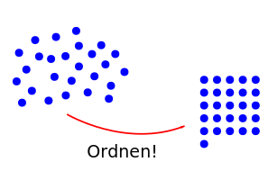
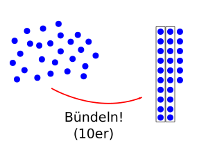

*************
Zahlensysteme
*************

https://gist.github.com/SMotaal/24006b13b354e6edad0c486749171a70#file-gh-markup-rst-rst

Zahlensysteme werden benötigt, um Werte bzw. Wertigkeiten darstellen zu können.
Die Darstellung der Zahlen, als Folgen von Ziffern mit verschiedenen Wertigkeiten, folgt bestimmten Regeln, die vom verwendeten Zahlensystem abhängig sind.

Im "täglichen Leben" verwenden wir das **Dezimalsystem**, in der Digitaltechnik und beim Programmieren bzw. in der Computertechnik werden jedoch auch andere Zahlensysteme verwendet, da diese besondere - praktische - Eigenschaften haben.

Die von uns betrachteten Zahlensysteme sind sogenannte **Stellenwert-Systeme**. Jede Ziffer liefert hier gleich zwei Informationen:

* Die **Stelle** (bzw. Position), an der die Ziffer steht, sagt etwas über die **Bündelungseinheit** aus
* Die **Ziffer** selbst gibt die **Anzahl der Bündel** an

Dazu folgendes Beispiel:

Gegeben sei eine gewisse Anzahl an Punkten, deren Anzahl man in einer Zahl audrücken möchte. Zuerst werden die Punkte geordnet:

   Ordnen der Punkte.

Danach werden die geordneten Punkte zu **Bündeln** zusammengefasst. In unserem Beispiel werdne immer **5** Punkte zu einem **Bündel** zusammengefasst.

   Gruppieren in 5-er-Bündel

Zuletzt zählen wir die **Bündel** und die einzelnen Punkte ab:

Es ergeben sich hier **5 Bündel** und **1 Punkt**, was wir wie folgt notieren können:

.. csv-table:: Zählen in 5er-Bündeln und Punkten
   :quote: "
	   
	   **Bündel**,**Punkte**
	   5,1

oder auch als die Zahl **51**.

Hier kommt nun **51** heraus, weil immer **5 Punkte** zu **1 Bündel** zusammengefasst wurden. Um die für uns gewohnte Zahl **26** zu erhalten (da es ja 26 Punkte sind!), müsste man jeweils **10 Punkte** zu **1 Bündel** zusammenfassen:

   Gruppieren in 10er-Bündel

Und somit:

.. csv-table:: Zählen in 10-er-Bündeln und Punkten
   :quote: "
	   
	   **Bündel**,**Punkte**
	   2,6

oder auch als die Zahl **26**.
  
Das bedeutet, dass jede Stelle eine gewisse **Wertigkeit** besitzt, und die Ziffer an jeder Stelle gibt an, **wie oft Mal** die Wertigkeit der jeweiligen Stelle zum Gesamtgergebnis (also zur abzubildenden Zahl), hinzuaddiert wird.

Ein Zahlensystem ist durch sogenannte **Nennwerte** definiert. Diese stellen die Menge der **möglichen Symbole pro Stelle** dar. Die Anzahl der Nennwerte wird **Basis** genannt. Da wir die :math:`0` (Null) auch mitzählen, ist der größte Nennwert :math:`Basis - 1`.

Hier ein Beispiel:

Die Zahl :math:`327` kann wie folgt gebildet werden:

:math:`(3 \times 100) + (2 \times 10) + (7 \times 1) =300+20+7 = \boldsymbol{327}`

Wird eine Stelle einer Zahl erhöht, ist das nun nur bis zum Wert :math:`Basis - 1` möglich. Beim Überschreiten des größten Nennwertes, wird die Stelle wieder auf :math:`0` gesetzt, und der sogenannte **Übertrag** wird in die nächsthöhere Stelle übertragen.

Hier ein Beispiel:

Beim Aufwärts-Zählen der Zahlen von :math:`0` weg:

.. csv-table:: Zählen
   :quote: "
	   
	   **Z**,**E**
	   0,0
	   0,1
	   0,2
	   ...,...
	   0,8
	   0,9
	   1,"**0** (Einerstelle wird wieder 0, nächsthöhere Stelle wird um 1 erhöht."
	   1,1
	   ...,...
	   

Es wird also **beim Überschreiten des höchstmöglichen Wertes** einer Stelle diese wieder auf :math:`0` gesetzt, und die nächsthöhere Stelle um
:math:`1` erhöht.
	   

Dezimalsystem
=============

.. csv-table:: Beispiel
	       :quote: "
		       
		       th,aws
		       ice cream,7
		       waffles,4

		    

t.b.d

Binärsystem
===========

t.b.d

Hexadezimalsystem
=================

*********************************
Umrechnen in andere Zahlensysteme
*********************************

